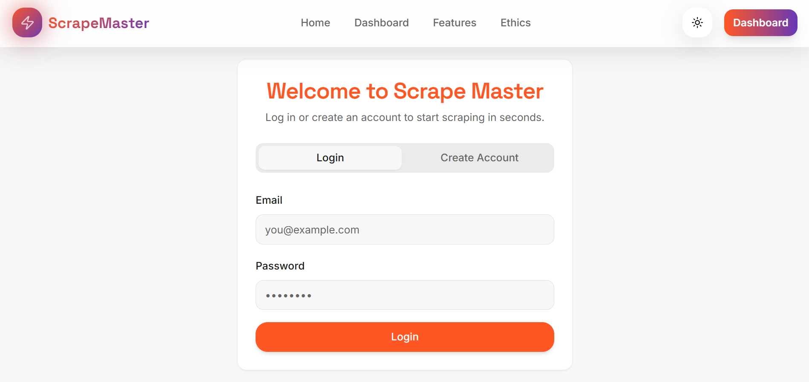
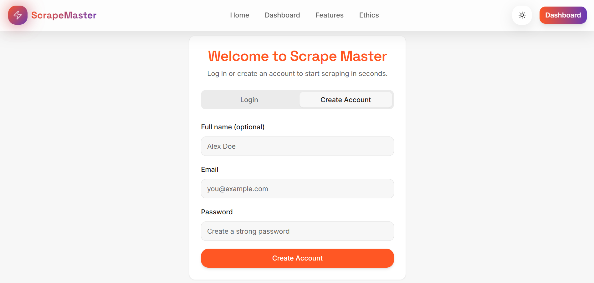
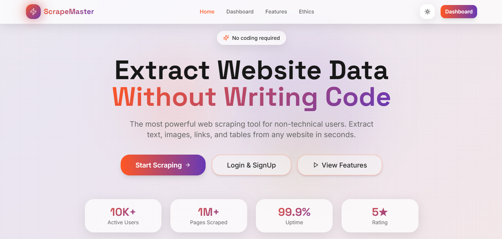
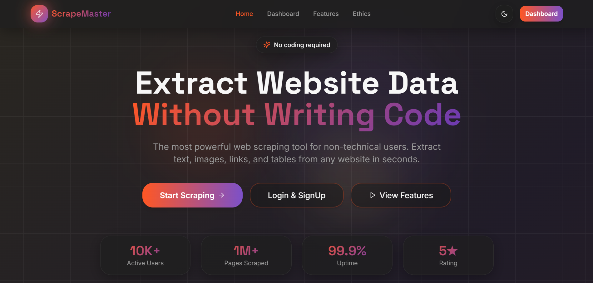
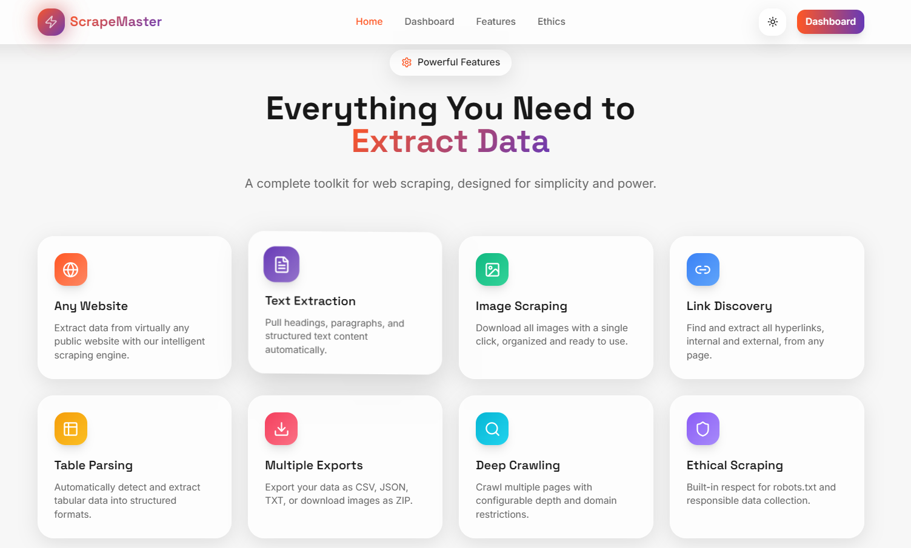
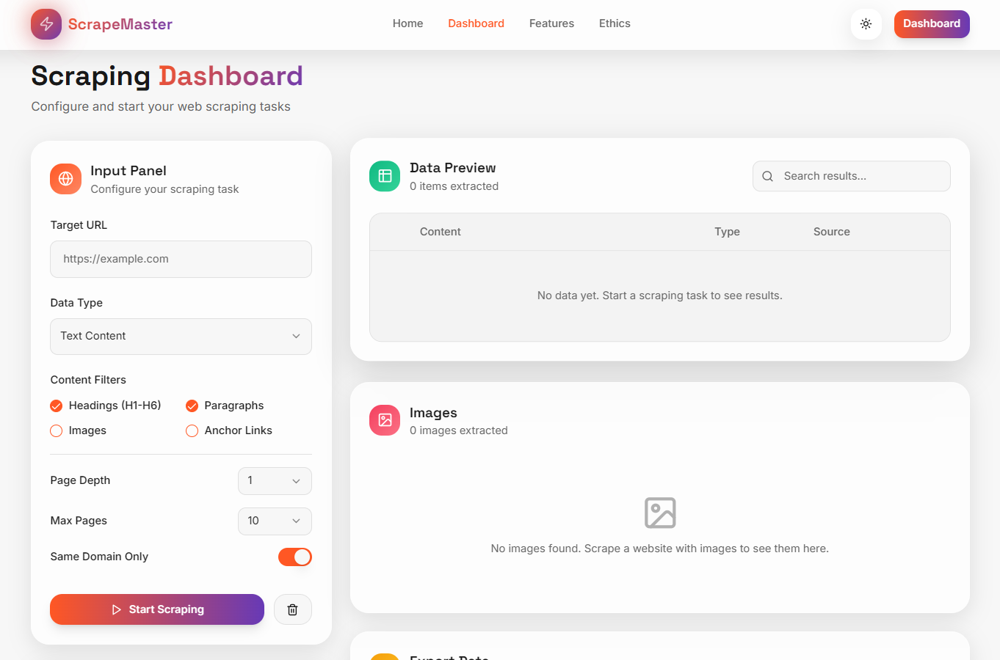
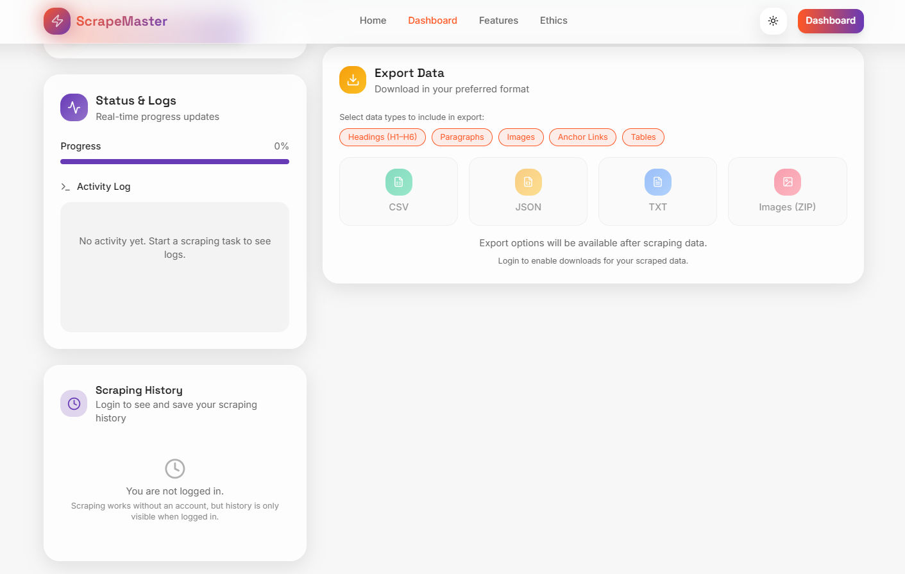

# 📊 Scrape Master

Scrape Master is a modern and responsive web application designed to collect, manage, and present data in an organized and user-friendly way.
The project focuses on simplicity, performance, and scalability, making it suitable for real-world applications and learning purposes.
Now includes a secure **Login & Signup authentication system** for personalized user access.

## ✨ Features

- 📁 Structured data management
- 🔐 User Authentication (Login & Signup)
- 🖥️ Clean and responsive user interface
- ⚡ Fast performance and smooth interactions
- 🌐 Web-based application accessible from any device
- 🚀 Deployed on Vercel for high availability
- 🧩 Scalable and maintainable project structure

## 🛠️ Tech Stack

- **Frontend:** React.js, JavaScript
- **Styling:** Tailwind CSS, CSS3
- **Authentication:** Supabase Auth
- **Backend Services:** Supabase
- **Version Control:** Git & GitHub

## 🔐 Authentication System

This project includes a secure authentication system that enables:

- User registration (Sign Up)
- User login (Sign In)
- Secure session management
- Access control for protected routes

Authentication is implemented using Supabase Auth, ensuring secure credential handling and session persistence.
Sensitive configuration details are managed using environment variables to maintain security best practices.

## ⚙️ Installation and Setup

Follow the steps below to run the project locally:

```bash
# Clone the repository
git clone https://scrape-master-two.vercel.app/

# Move into the project directory
cd Scrape Master

# Install dependencies
npm install

# Start the development server
npm start
```

## 📸 Screenshots

### 🔐 Login & SignUp Page
<p>
  Login Page<br><br>
  
  <br/><br/>
  SignUp Page<br><br>
  
</p>

---

### 🏠 Homepage
<p>
  Light Mode<br><br>
  
  <br/><br/>
  Dark Mode<br><br>
  
</p>

---

### ✨ Features Page
<p>
  
</p>

---

### 📊 Dashboard
<p>
  
  <br/><br/>
  
</p>

---

## 👨‍💻 Author

Abhi
GitHub: https://github.com/Wraith1057
